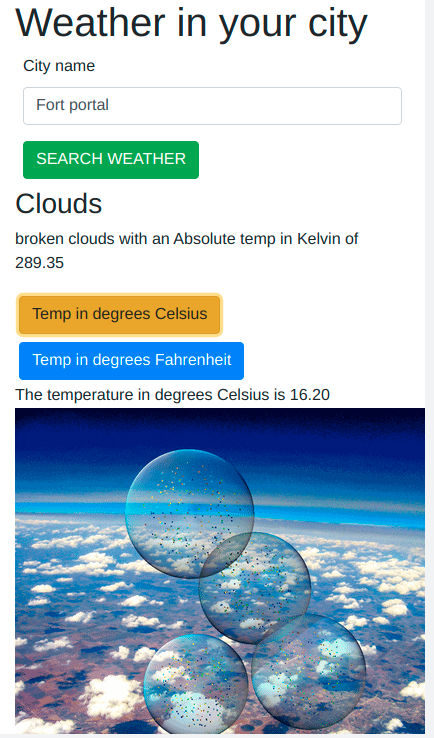
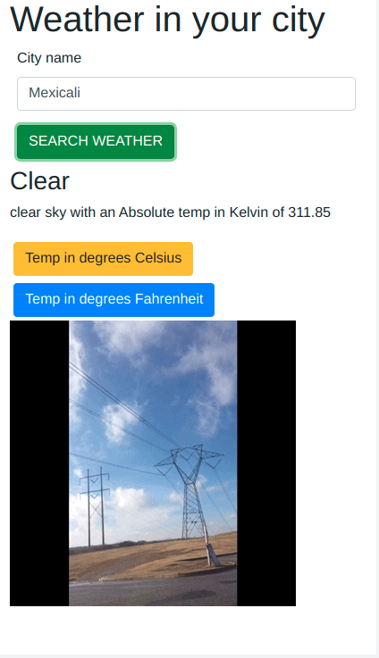
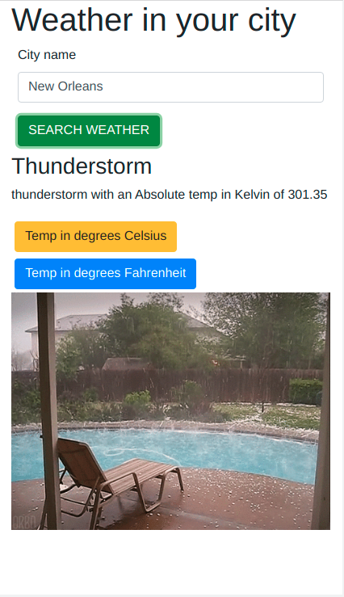

# weather-app

> A weather forecast website using fetch API and asynchronous JavaScript best practices such a promises, async functions and the await keyword. It accesses data from the openweathermap API and displays custom results using the Giphy API. Error handling for the asynchronous function is done using a catch clause.

### Example screenshots

|  | |  | 
|:---:|:---:|:---:|
| Cloudy weather | Clear weather | Contact Tab |

## Built With

- HTML5 & CSS3, & JavaScript
- Bootstrap

## Instructions
To get a local copy up and running follow these simple example steps.

### Prerequisites
- Gitbash installed to navigate between the branches.
- A preferred text editor for example VS Code.
- A browser such as Google Chrome

### Install
Clone this [GitHub Repo](https://github.com/KabohaJeanMark/weather-app/) to your computer on yourFolder by typing these commands in the terminal or download as a Zip file and extract.
```
$ mkdir yourFolder
$ cd yourFolder
$ git clone https://github.com/KabohaJeanMark/weather-app/

```

### Using webpack
- Install the packages locally and run the command to modify your bundled js based on changes in the JavaScript file.
```
npm install
npm run dev
```
- Run the following command so that webpack to always watch your changes and updates your modified js whenever changes are made to the index.js or its module files it is importing from.
```
npm run watch
```

### Usage
- View with live Server in VS code or Right click and open the index.html in your browser to view.
- Type in the full name of your city and click the green search weather button. If a user fails to type in a full name of the city, an error message is displayed stating "Please enter full city name. Cannot fetch the data".
- Details about your weather will return with an overall weather condition, a small description and an absolute temperature in Kelvin.
- To view your temperature in either degrees celsius or fahrenheit, please toggle between clicking the top buttons for celsius and fahrenheit.
- Below these two buttons will be a fun gif showing the weather display in an animated form.

### API Tips
- Both API's require 2 parameters, a search term and an API KEY.
- For more details on the GIPHY API and how to generate your own API KEY for GIPHY, please sign up and check out this [resource](https://support.giphy.com/hc/en-us/articles/360035158412--Do-I-need-to-obtain-an-API-Key-to-get-started-playing-with-the-GIPHY-API-)
- For more details on how to generate your own API KEY and consume the openweahermap API, please sign up and follow this [resource](https://openweathermap.org/current)

## Author

👤 **Kaboha Jean Mark**

- GitHub: [@KabohaJeanMark](https://github.com/KabohaJeanMark)
- Twitter: [@jean_quintus](https://twitter.com/jean_quintus)
- LinkedIn: [Jean Mark Kaboha](https://www.linkedin.com/in/jean-mark-kaboha-software-engineer/)


## 🤝 Contributing

Contributions, issues, and feature requests are welcome!

Feel free to check the [issues page](https://github.com/KabohaJeanMark/weather-app/issues).

## Show your support

Give a ⭐️ if you like this project!

## Acknowledgments

- Hat tip to Microverse for the README template, instructions and tutoring for this Capstone project.

## 📝 License

This project is [MIT](./LICENSE) licensed.